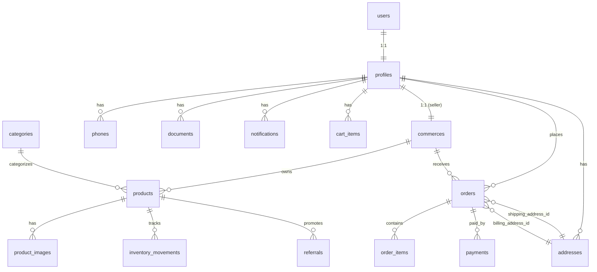
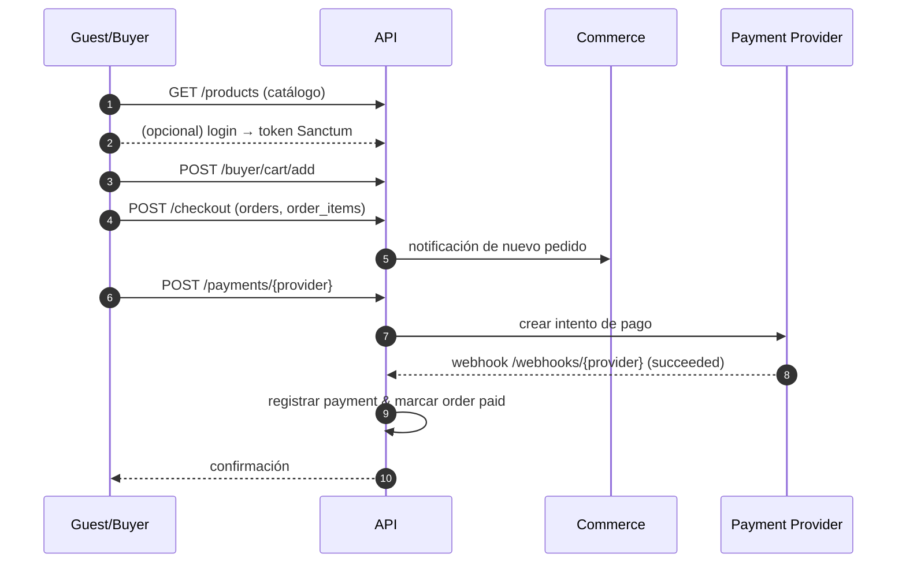
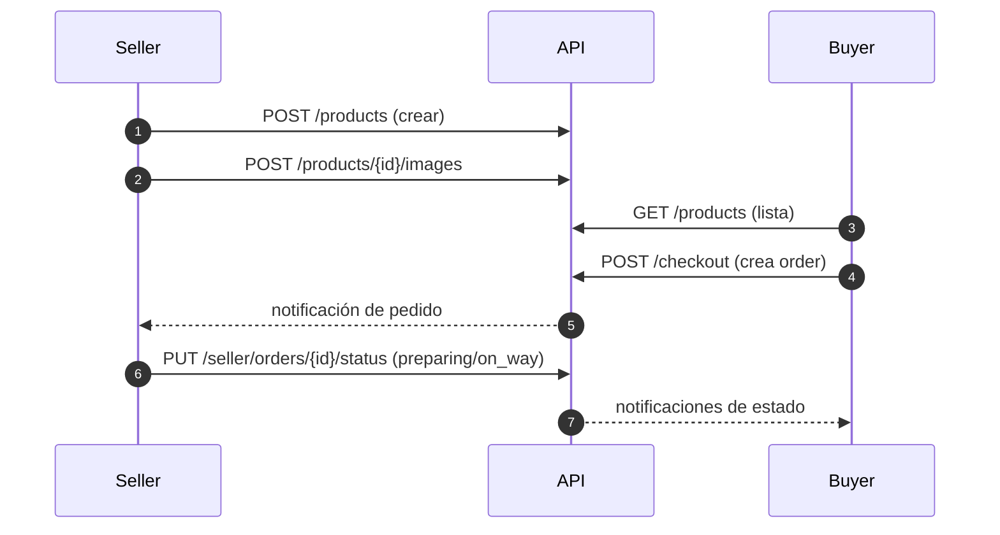

## Zonix Imports — Backend (Laravel 10)

API REST para el MVP de e‑commerce multi‑modal en Venezuela (detal, mayor, pre‑order con abonos, referidos, dropshipping). Pagos descentralizados por vendedor (Stripe, PayPal, Pago Móvil, Zelle, Binance Pay/USDT). Basado en Laravel 10 + MySQL 8.

### 0) Modelo de negocio (reglas en API)

#### **Modalidades de Venta:**
- **Detal (retail)**: Requiere stock; usa `base_price` como precio unitario.
- **Mayor (wholesale)**: Campos `min_wholesale_quantity` y `wholesale_price`; validar cantidad mínima en carrito/checkout.
- **Pre-order**: Campo `preorder_eta` (ETA); registrar abonos (pagos parciales) con estado `partially_paid`; entregar solo con 100% pago.
- **Referidos**: Tabla `referrals` con `percentage` y `link` único; atribución por link; registrar `commission_earned`.
- **Dropshipping interno**: Campo `origin_product_id`; validar stock del origen en compra; liquidación entre vendedores (reglas mínimas en MVP).

#### **Pagos Descentralizados:**
- Cada vendedor (`commerces`) habilita sus métodos de pago en `payment_methods` JSON.
- **API**: Stripe, PayPal, Binance Pay (webhooks idempotentes con `processed_webhook_events`).
- **Manual**: Pago Móvil, Zelle (subir comprobante → validación vendedor → auditoría admin).
- Validación de operadoras (`operator_codes`) y bancos (`banks`) para pagos locales.

#### **Roles y Verificación:**
- **Visitante (guest)**: No autenticado; puede explorar el catálogo público, no puede comprar.
- **Comprador (buyer)**: Rol por defecto al autenticarse; puede comprar.
- **Vendedor (seller)**: Requiere RIF, banco, documentos verificados; puede publicar productos y también comprar (mismo perfil).
- **Admin**: Sólo gestión (usuarios, pedidos, disputas, productos).

Notas de autorización (MVP):
- El catálogo es público (guests pueden ver, no comprar).
- Rutas de compra (carrito/checkout/pedidos) permiten buyer y seller.
- Rutas de vendedor requieren seller verificado.
- Sin policies/middlewares personalizados adicionales por ahora (se controlará a nivel de controlador donde aplique).

### 1) Requisitos
- PHP 8.2+
- Composer 2.x
- MySQL 8.x
- Extensiones: OpenSSL, PDO, Mbstring, Tokenizer, JSON, cURL, Fileinfo

### 2) Configuración e instalación
1. Copiar variables de entorno:
   - `cp .env.example .env`
2. Configurar `.env` (DB, APP_URL, CORS, SANCTUM, MAIL, STORAGE):
   - `APP_NAME=ZonixImports`
   - `APP_ENV=local`
   - `APP_KEY=` (se genera luego)
   - `APP_URL=http://localhost`
   - `DB_CONNECTION=mysql`
   - `DB_HOST=127.0.0.1`
   - `DB_PORT=3306`
   - `DB_DATABASE=zonix`
   - `DB_USERNAME=root`
   - `DB_PASSWORD=`
   - `SANCTUM_STATEFUL_DOMAINS=localhost`
   - `FRONTEND_URL=http://localhost:5173` (o la URL móvil si aplica)
   - `MAIL_MAILER=smtp` (configurar credenciales)
   - Proveedores de pago (según habilitados):
     - `STRIPE_SECRET=...`
     - `PAYPAL_CLIENT_ID=...`, `PAYPAL_SECRET=...`
     - `BINANCE_PAY_KEY=...`, `BINANCE_PAY_SECRET=...`
   - Webhooks (recomendado):
     - `STRIPE_WEBHOOK_SECRET=...`
     - `PAYPAL_WEBHOOK_ID=...`
     - `BINANCE_WEBHOOK_SECRET=...`
3. Instalar dependencias:
   - `composer install`
4. Generar clave app:
   - `php artisan key:generate`
5. Ejecutar migraciones y seeders:
   - `php artisan migrate --seed`
6. Storage link (archivos y comprobantes):
   - `php artisan storage:link`
7. Ejecutar servidor:
   - `php artisan serve`

### 3) Arquitectura
- Capas: `Controllers` delgados, `Services` para negocio, `FormRequest` para validación, `Policies/Middleware` para permisos.
- Autenticación: Laravel Sanctum (tokens) + OAuth2 Google (login) [controlador/servicio dedicado].
- Eventos/Listeners para: pedidos, pagos, notificaciones; webhooks idempotentes.
- Logging sin datos sensibles; manejo de errores con códigos HTTP claros.
 - Estándar de respuesta de error: `{ message, errors?, code }`

### 4) Modelo de datos (tablas clave)

#### **Autenticación y Usuarios:**
- `users` - Usuarios del sistema (Laravel Auth)
- `profiles` - Perfiles extendidos (1:1 con users) + roles + datos vendedor
- `personal_access_tokens` - Tokens Sanctum para API

#### **E-commerce Core:**
- `commerces` - Vendedores/comercios + métodos de pago habilitados
- `categories` - Categorías de productos
- `products` - Productos con modalidades (detal, mayor, pre-order, referidos, dropshipping)
- `product_images` - Múltiples imágenes por producto
- `cart_items` - Carrito persistente con snapshot de precios
- `orders` - Pedidos con modalidades y estados
- `order_items` - Items del pedido con subtotales

#### **Pagos y Finanzas:**
- `payments` - Pagos (API + manuales) con external_id y moneda
- `processed_webhook_events` - Idempotencia de webhooks
- `banks` - Bancos para Pago Móvil y transferencias
- `referrals` - Programa de referidos con comisiones

#### **Inventario y Logística:**
- `inventory_movements` - Movimientos de stock con trazabilidad
- `addresses` - Direcciones de envío con referencias
- `notifications` - Notificaciones con prioridad

#### **Contacto y Documentación:**
- `phones` - Múltiples teléfonos por usuario
- `operator_codes` - Códigos de operadoras para Pago Móvil
- `documents` - Documentos de verificación (RIF, CI, etc.)
- `countries`, `states`, `cities` - Datos geográficos

#### **Infraestructura Laravel:**
- `cache`, `jobs`, `password_reset_tokens` - Tablas del framework

#### 4.1) Acceso por rol y uso de tablas (MVP)

- Rol efectivo único en `users.role` (`buyer` por defecto si está vacío). `profiles` mantiene relación 1:1 con `users` para datos extendidos. El resto de las tablas de negocio referencian `profiles.id` (no `users.id`). Excepción: `personal_access_tokens` (Sanctum) y autenticación.

- Guest (no autenticado)
  - Lectura: `products`, `product_images`, `categories`, `commerces` (abiertos), opcional `referrals` para mostrar landing.
  - Escritura: ninguna.

- Buyer (autenticado con intención de compra)
  - Identidad/contacto: `profiles` (1:1), `phones`, `addresses`, `documents`.
  - Compra: `cart_items`, `orders`, `order_items`, `payments`.
  - Notificaciones: `notifications`.
  - Soporte/maestros (solo lectura): `banks`, `operator_codes`, `countries`, `states`, `cities`, `categories`, `commerces`.

- Seller (vendedor; también puede comprar)
  - Identidad/negocio: `profiles` (1:1), `commerces` (1:1 con `profiles`), `documents` (verificación), `banks` (referencia para pagos).
  - Catálogo/inventario: `products`, `product_images`, `inventory_movements`, `referrals`.
  - Pedidos/pagos: `orders` (como vendedor mediante `commerce_id`), `order_items`, `payments`.
  - Notificaciones: `notifications`.

- Admin
  - Lectura/escritura sobre todas las anteriores para gestión y auditoría, sin cambiar autenticación.

Notas de modelado claves:
- Todas las relaciones de negocio deben colgar de `profiles` (campo `profile_id`) en lugar de `user_id`, excepto las propias del sistema de auth.
- `commerces` es 1:1 con `profiles` del seller.
- `orders` enlaza a `profiles` (comprador) y a `commerces` (vendedor).
- `payments` enlaza a `orders`; los webhooks son idempotentes vía `processed_webhook_events`.

#### 4.2) Diagrama ER (tablas clave)

Imagen: docs/diagrams/er.svg

#### 4.3) Secuencias (Buyer y Seller)

Compra (buyer):

Imagen: docs/diagrams/seq-buyer.svg

Publicación y venta (seller):

Imagen: docs/diagrams/seq-seller.svg

### 5) Endpoints API (mínimos)
Prefijo `/api`.

#### **Autenticación:**
- POST `/auth/google` → login con OAuth2
- GET `/me` → perfil actual
- PUT `/me/role` → cambio a vendedor (RIF/banco/documentos requeridos)

#### **Productos y Catálogo:**
- CRUD `/products` → gestión de productos
- GET `/products?filtros...` → catálogo paginado con modalidades
- POST `/products/{id}/images` → subir imágenes
- GET `/categories` → categorías disponibles

#### **Carrito y Checkout:**
- POST `/cart` → agregar producto al carrito
- GET `/cart` → obtener carrito del usuario
- PUT `/cart/{item}` → actualizar cantidad
- DELETE `/cart/{item}` → eliminar del carrito
- POST `/checkout` → crear pedido

#### **Pagos:**
- POST `/payments/stripe|paypal|binance` → intentos de pago API
- POST `/payments/comprobante` → flujo manual Pago Móvil/Zelle
- POST `/webhooks/{provider}` → confirmaciones idempotentes
- GET `/payments/methods` → métodos habilitados por vendedor

#### **Pedidos:**
- GET `/orders` → pedidos del comprador
- GET `/seller/orders` → pedidos del vendedor
- PUT `/seller/orders/{id}/status` → cambiar estado del pedido
- GET `/orders/{id}/tracking` → seguimiento de envío

#### **Referidos:**
- POST `/referrals` → crear link de referido
- GET `/referrals` → links del vendedor
- GET `/referrals/stats` → estadísticas de comisiones

#### **Notificaciones:**
- GET `/notifications` → notificaciones del usuario
- PUT `/notifications/{id}/read` → marcar como leída

### 6) Políticas y seguridad
- HTTPS (TLS 1.2+), CORS configurado
- Roles: comprador, vendedor, admin (Policies/Middleware)
- Validación con `FormRequest`; sanitización de entradas
- Rate limiting en auth y webhooks
- Secretos solo en `.env`
 - Validar firma de webhooks y prevenir reintentos (idempotencia por `event_id`)

### 7) Rendimiento
- Paginación obligatoria en listados grandes
- Eager loading para evitar N+1
- Cache básico en datos estáticos (categorías)
- Tiempos objetivo: ≤2s (pequeñas), ≤4s (grandes)
 - Seleccionar columnas necesarias; índices adecuados

### 8) Pagos (descentralizado)
- Métodos por vendedor; checkout muestra solo habilitados
- API: Stripe, PayPal, Binance Pay (webhooks marcan `pagado`)
- Manual: Pago Móvil, Zelle (subir comprobante → validación del vendedor → auditoría admin)
 - Guardar comprobantes en `storage/app/public/payments/` (nunca datos de tarjetas)

### 9) Notificaciones
- Internas y por correo en eventos clave (creación de pedido, cambio de estado, validación de pago, recordatorio de abonos)

### 10) Desarrollo y contribución
- Commits convencionales: `tipo(scope): resumen`
- PRs pequeñas con pruebas locales: `php artisan test`
- Sin secretos en el repo; enlazar evidencias de pruebas manuales en PRs
 - Estándar de ramas: `feat/*`, `fix/*`, `chore/*`, `docs/*`

### 11) Scripts útiles
- Ejecutar pruebas: `php artisan test`
- Ejecutar seeders: `php artisan db:seed`
- Refrescar DB: `php artisan migrate:fresh --seed`
- Limpiar caches: `php artisan optimize:clear`
 - Jobs/queues (si se usan): `php artisan queue:work`

### 12) Roadmap (MVP)
- S1: Infra + Auth
- S2: Productos, catálogo, carrito, checkout, pedidos (comprador)
- S3: Publicación, inventario, pedidos vendedor, pre‑order abonos
- S4: Admin mínimo, QA, deploy

### 13) Observaciones
- Webhooks deben ser idempotentes y validados con firma
- Logs sin PII ni datos de tarjetas; evitar almacenar comprobantes con información sensible
 - Respetar prefijo `/api` y paginación por defecto

### 14) Integración con Frontend (Flutter)
- `FRONTEND_URL` en `.env` para CORS.
- Autenticación: emitir tokens Sanctum; el cliente envía `Authorization: Bearer <token>`.
- Estructura de error: `{ message, errors?, code }`; `errors` es diccionario campo→mensajes.
- Paginación: devolver `{ data, meta: { current_page, per_page, total } }`.
- Fechas: ISO 8601 UTC; documentar TZ si difiere.
- Moneda: retornar decimales (no enteros escalados); frontend formatea.

